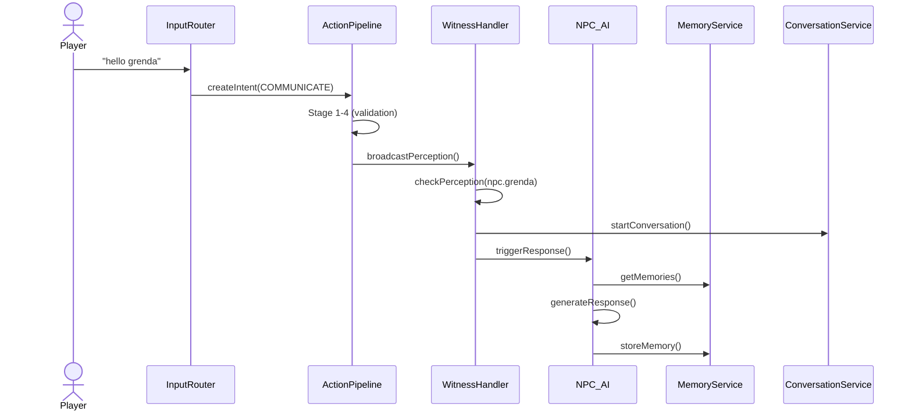

# Root Cause Analysis: Conversation System Debugging

**Date:** 2026-02-09  
**Status:** Retrospective  
**Question:** Why did debugging take so long? What architectural improvements are needed?

---

## 🎯 Executive Summary

**Debugging the conversation system took ~3-4 hours due to architectural fragmentation, implicit dependencies, and multiple competing data flows.**

The fundamental issue: **Conversations are implemented in 4+ different ways across the codebase, with no clear ownership or single source of truth.**

---

## 🔍 Root Cause Analysis

### Root Cause #1: **Multiple Parallel Implementations**

**The Problem:**
Conversations are handled by at least 4 different systems that don't coordinate:

```
1. ActionPipeline (NEW - you're building this)
   └─ Handles COMMUNICATE verb, broadcasts perception
   └─ File: action_system/pipeline.ts
   └─ Status: Partially implemented

2. Interpreter AI (EXISTING - handles natural language)
   └─ Parses "hello grenda" → COMMUNICATE intent
   └─ File: interpreter_ai/main.ts
   └─ Status: Works, but bypasses ActionPipeline for processing

3. NPC_AI Direct Handler (EXISTING - quick reactions)
   └─ Receives messages directly from DataBroker
   └─ File: npc_ai/main.ts:500-1000
   └─ Status: Works, creates conversations independently

4. Conversation Manager (EXISTING - archival storage)
   └─ Stores full conversation history
   └─ File: conversation_manager/archive.ts
   └─ Status: Works, but isolated from other systems

5. Witness Handler (NEW - you're building this)
   └─ Supposed to trigger via ActionPipeline
   └─ File: npc_ai/witness_handler.ts
   └─ Status: Incomplete integration
```

**Why This Caused Debug Hell:**
- When you typed "hello grenda", it was processed by Interpreter AI → NPC_AI directly
- ActionPipeline was being bypassed entirely
- Witness handler was never called because it wasn't in the chain
- We had to patch pattern matching to even reach ActionPipeline
- Then fix tool validation
- Then fix sense profiles
- Then discover witness events weren't being triggered

**Each fix revealed the next broken link in a chain we couldn't see.**

---

### Root Cause #2: **Implicit Dependencies & Hidden State**

**The Problem:**
State exists in multiple places with no synchronization mechanism:

```typescript
// Where is "in conversation" state stored?

// 1. In-memory only (lost on restart)
const active_conversations = new Map(); // conversation_state.ts

// 2. Place data (persistent, but separate)
npc_in_place.status = "busy"; // Updated via update_npc_status_in_place()

// 3. NPC memory_sheet (persistent, but different format)
npc.memory_sheet.conversation_threads = [...]; // npc_ai/main.ts

// 4. Conversation Archive (persistent, full history)
conversation_manager/archive.ts

// 5. Frontend React state (ephemeral)
current_place.npcs[0].status // movement_command_handler.ts
```

**Why This Caused Debug Hell:**
- Backend says "in conversation: true"
- Place data says "status: present"
- Frontend shows "in_conversation: false"
- Race condition between STATUS command and API refresh
- No clear answer to "what is the source of truth?"

---

### Root Cause #3: **No Clear Data Flow Diagram**

**The Problem:**
There's no documentation showing how a conversation flows from user input to NPC response.

**What We Had to Discover:**
```
User Input "hello grenda"
    ↓ (HTTP POST)
interface_program/main.ts HTTP handler
    ↓ (write to inbox.jsonc)
DataBroker polls inbox
    ↓ (route to Interpreter AI)
Interpreter AI parses to COMMUNICATE intent
    ↓ (broker out)
DataBroker creates machine-readable event
    ↓ (NPC_AI polls)
npc_ai/main.ts receives directly
    ↓ (bypasses ActionPipeline!)
NPC_AI generates response
    ↓ (never calls witness handler)
Conversation happens, but witness system not triggered
```

**ActionPipeline was a sidecar, not the main highway.**

---

### Root Cause #4: **Inadequate Debug Observability**

**The Problem:**
- No centralized logging of conversation flow
- Critical functions lacked console.log statements
- No way to trace a single conversation through all systems
- Had to add logging retroactively to understand the flow

**What We Had to Add:**
- `[WITNESS]` prefix logging to witness_handler.ts
- `[PIPELINE]` logging to pipeline.ts
- `[CONV_STATE]` logging to conversation_state.ts
- Pattern matching debug logs
- Perception detection logs

**This should have been there from the start.**

---

### Root Cause #5: **Unclear System Boundaries**

**The Problem:**
Systems don't have clear interfaces or responsibilities:

| System | Should Handle | Actually Handles |
|--------|---------------|------------------|
| ActionPipeline | Action execution, perception broadcast | Tool validation fails, witness events not called |
| Witness Handler | All NPC reactions to perception | Only movement commands, not integrated with NPC_AI response |
| NPC_AI | NPC responses, personality, memory | Direct conversation handling, bypasses pipeline |
| Conversation Manager | Storage only | Storage, but isolated |

**The Fix:**
Consolidate conversation flow through ActionPipeline → Witness Handler → NPC_AI

---

## ✅ Proposed Architectural Improvements

### Solution #1: **Single Data Flow - The "Pipeline Principle"**

**Rule:** ALL conversation actions MUST flow through ActionPipeline.

**Architecture:**
```
User Input
    ↓
[Input Router]
    └─ If matches action pattern → ActionPipeline
    └─ If complex/narrative → Interpreter AI → THEN ActionPipeline
    ↓
[ActionPipeline]
    Stage 1: Target Resolution
    Stage 2: Validation
    Stage 3: Cost Check
    Stage 4: Rules Check
    Stage 5: Broadcast Perception (BEFORE execution)
    Stage 6: Execute Action
    Stage 7: Broadcast Perception (AFTER execution) + Witness Processing
    ↓
[Witness Handler]
    └─ For each observer NPC:
        - Check perception (distance, vision cone, etc.)
        - Calculate interest (personality-based)
        - Update NPC state (conversation, memory, etc.)
        - Send movement commands (face, stop)
    ↓
[NPC_AI Response Generator]
    └─ Generate response using:
        - Conversation context
        - Personality
        - Memory
        - Current state
    ↓
[Memory Consolidation]
    └─ Store to npc_storage/memory.ts
    └─ Update conversation_manager/archive.ts
    ↓
[Frontend Update]
    └─ STATUS commands update visual state
    └─ API refresh shows consistent state
```

**Implementation:**
- Modify `interface_program/main.ts` to ALWAYS route through ActionPipeline
- Remove direct NPC_AI conversation handling
- NPC_AI only generates responses, doesn't manage state

---

### Solution #2: **Single Source of Truth for Conversation State**

**Rule:** One system owns conversation state, everyone else reads from it.

**Architecture:**
```typescript
// SOLUTION: Conversation Service owns all state

// File: src/services/conversation_service.ts (NEW)
class ConversationService {
    // Single in-memory source of truth
    private active_conversations: Map<string, Conversation>;
    
    // Single method to start conversation
    startConversation(participants: string[]): Conversation;
    
    // Single method to end conversation
    endConversation(conversationId: string): void;
    
    // Query methods (read-only for other systems)
    isInConversation(entityRef: string): boolean;
    getConversation(entityRef: string): Conversation | null;
    getParticipants(conversationId: string): string[];
    
    // Persistence (async, non-blocking)
    private persistToStorage(): void;
}

// All systems import and use ConversationService
// No direct manipulation of conversation state
```

**Benefits:**
- One place to debug
- No race conditions
- Clear data flow
- Easy to test

---

### Solution #3: **Comprehensive Debug Logging from Day 1**

**Rule:** Every system must log its actions with standardized prefixes.

**Implementation:**
```typescript
// File: src/shared/debug_logger.ts (NEW)
export const LogPrefix = {
    PIPELINE: '[PIPELINE]',
    WITNESS: '[WITNESS]',
    CONVERSATION: '[CONV]',
    MEMORY: '[MEMORY]',
    NPC_AI: '[NPC_AI]',
    MOVEMENT: '[MOVE]',
    PERCEPTION: '[PERCEPT]',
    ACTION: '[ACTION]',
} as const;

export function log(prefix: string, message: string, data?: any): void {
    const timestamp = new Date().toISOString();
    console.log(`${timestamp} ${prefix} ${message}`, data || '');
}

// Usage in any file:
import { log, LogPrefix } from '../shared/debug_logger.js';

log(LogPrefix.WITNESS, `Processing event for ${npc_ref}`, { verb: event.verb });
```

**Required Logging Points:**
1. Entry/exit of every public function
2. State changes (before and after)
3. Decision points (if/else branches taken)
4. External system calls
5. Error conditions

---

### Solution #4: **Visual Architecture Documentation**

**Rule:** Every system must have:
1. Data flow diagram
2. Sequence diagram for main use cases
3. State machine diagram (if applicable)
4. Clear interface definitions

**Implementation:**
```markdown
<!-- File: docs/diagrams/conversation_flow.md -->

## Conversation Flow



**Benefits:**
- New developers understand the system quickly
- Debugging has a reference
- Prevents architectural drift
- Shows where to add logging

---

### Solution #5: **Interface Contracts (TypeScript)**

**Rule:** All inter-system communication uses strict TypeScript interfaces.

**Current Problem:**
```typescript
// BAD: Any type, no contract
function process_witness_event(observer_ref: string, event: any): void {
    // What properties does event have?
    // Who knows? Check the code.
}
```

**Solution:**
```typescript
// File: src/types/conversation.ts
export interface WitnessEvent {
    observerRef: string;
    actorRef: string;
    verb: ActionVerb;
    location: TilePosition;
    details: {
        messageText?: string;
        volume?: 'whisper' | 'normal' | 'shout';
        targetRef?: string;
    };
    distance: number;
    timestamp: number;
}

export interface ConversationState {
    id: string;
    participants: Participant[];
    status: 'active' | 'paused' | 'ended';
    startedAt: number;
    lastActivityAt: number;
}

// Function has strict contract
function processWitnessEvent(event: WitnessEvent): WitnessResult {
    // Compiler enforces the contract
}
```

**Benefits:**
- Catch errors at compile time
- IDE autocomplete
- Self-documenting code
- Clear boundaries between systems

---

## 🤔 Should Systems Be Consolidated?

**Short Answer: Partially Yes, But Not Completely**

### What SHOULD Be Consolidated:

1. **Conversation State Management**
   - ✅ Consolidate into single ConversationService
   - Remove scattered state in conversation_state.ts, witness_handler.ts, npc_ai/main.ts

2. **Debug Logging**
   - ✅ Single debug logging utility
   - Used by all systems
   - Standardized prefixes

3. **Data Flow**
   - ✅ Single entry point: ActionPipeline
   - Remove direct Interpreter → NPC_AI path
   - All actions flow through same pipeline

### What Should NOT Be Consolidated:

1. **Memory Storage vs Conversation Archive**
   - ❌ Keep separate
   - Memory = AI context (short-term, filtered)
   - Archive = Historical record (long-term, complete)

2. **NPC_AI Response Generation**
   - ❌ Keep separate from ActionPipeline
   - Pipeline = Orchestration
   - NPC_AI = Business logic (personality, etc.)

3. **Perception System vs Witness Handler**
   - ❌ Keep separate
   - Perception = Detection (who can sense what)
   - Witness = Reaction (what to do about it)

### The Right Balance:

```
CONSOLIDATE (Single Responsibility):
├── ConversationService (all conversation state)
├── DebugLogger (all logging)
└── ActionPipeline (all action flows)

KEEP SEPARATE (Separation of Concerns):
├── PerceptionSystem (senses, detection)
├── WitnessHandler (reactions, state updates)
├── NPC_AI (response generation, personality)
├── MemoryService (storage, retrieval)
└── ConversationArchive (historical storage)
```

---

## 📋 Updated Plan: Preventing Future Debug Hell

### Immediate Actions (Add to Plan):

- [ ] **Create ConversationService** - Single source of truth
  - Migrate all conversation state here
  - Update all systems to use it
  - Add comprehensive logging

- [ ] **Standardize Debug Logging** - DebugLogger utility
  - Create src/shared/debug_logger.ts
  - Update all conversation-related files
  - Document log prefixes

- [ ] **Create Visual Architecture Diagrams**
  - Mermaid sequence diagrams
  - Data flow diagrams
  - State machines
  - Add to docs/

- [ ] **Strict TypeScript Interfaces**
  - src/types/conversation.ts
  - src/types/witness.ts
  - Enforce at compile time

### Medium-Term:

- [ ] **Input Router Refactor**
  - All input goes through ActionPipeline
  - Remove direct Interpreter → NPC_AI path
  - Document the flow

- [ ] **State Synchronization**
  - ConversationService persists to storage
  - Frontend subscribes to changes
  - No race conditions

- [ ] **Integration Tests**
  - Test full conversation flow
  - Mock external dependencies
  - Verify state consistency

---

## 💡 Key Insights

### What We Learned:

1. **Implicit architecture is technical debt** - If you can't draw it, it will break
2. **Multiple data flows = debugging nightmare** - Pick one path, make it work
3. **Logging is not optional** - It's as important as the code
4. **State ownership must be explicit** - "Single source of truth" is not just a buzzword
5. **Interfaces are documentation** - TypeScript types prevent entire classes of bugs

### The Real Fix:

**Not just fixing the conversation system, but establishing patterns that prevent this on the next system:**

- Visual documentation first
- Single data flow
- Strict interfaces
- Comprehensive logging
- Clear ownership

---

## ✅ Recommendation

**Proceed with the Conversation Plan, BUT add these prerequisites:**

1. **Before Phase 1**: Create ConversationService and DebugLogger
2. **During Phase 1**: Document the data flow with diagrams
3. **After Phase 1**: Add integration tests
4. **Before Phase 2**: Strict TypeScript interfaces

**This will take an extra 1-2 days upfront but save 10+ hours of debugging later.**

---

**Next Step:** Shall I create the ConversationService and DebugLogger foundation? Or would you prefer to review and modify the plan first?
